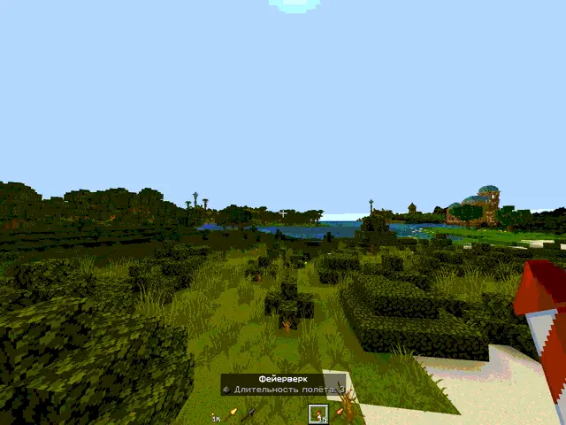
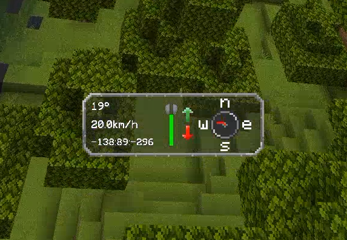

> **Language:** [Русский](README.md) · English

# Simple Elytra Hud Extended (Minecraft 1.21.4)


> **Added in this version:** support for custom modded elytra. The HUD now works not only with vanilla elytra (`minecraft:elytra`), but also with any glider items from mods (e.g. netherite elytra, elytra from `Elytra Reborn`, `Elytra Revamped` and similar) thanks to the check through `LivingEntity#canGlideWith`.

---

## About

**Elytra Hud** adds a new way to fly with your elytra, displaying essential flight telemetry on your screen in real time.

---

## Interface Gallery

| Real-Time Flight HUD | HUD Interface Elements |
|:---:|:---:|
|  |  |

---

## HUD Features

- **Left Panel**:
  1. Current pitch angle.
  2. Flight speed (km/h, m/s, or mph).
  3. Current player coordinates (X, Y, Z).
- **Middle Panel**:
  - Graphical durability gauge for your elytra.
  - Climb and dive indicator arrows.
- **Right Panel**:
  - Dynamic compass always pointing in your movement direction.
- **Configuration Options**:
  - HUD Visibility (toggle on/off).
  - HUD Delay before appearing.
  - Elytra Durability bar toggle.
  - Coordinate display toggle.
  - Speed unit selection (km/h, m/s, mph).

---

## Installation

1. Download the latest release from [GitHub Releases](https://github.com/byMr712/SimpleElytraHudExtended-1.21.4-MinecraftMod/releases).
2. Requires:
   - [Fabric Loader](https://fabricmc.net/) (Minecraft 1.21.4)
   - [Fabric API](https://modrinth.com/mod/fabric-api)
   - [YetAnotherConfigLib (YACL)](https://modrinth.com/mod/yacl)
   - [Mod Menu](https://modrinth.com/mod/modmenu) (recommended)
3. Place the `.jar` file into your `mods` folder.
4. Launch the game.

---

## Building

1. Requires Java 21 and Fabric Loader for Minecraft 1.21.4.
2. To build the project, run:
   ```bash
   ./gradlew build
   ```
3. The built jar file will be located at `build/libs/SimpleElytraHudExtended-1.21.4-byMr712.jar`.

---

## Credits & License

- Original Code: [Lukasabbe](https://github.com/lukasabbe) ([Simple Elytra Hud](https://modrinth.com/mod/simpleelytrahud)).
- Modified and extended for 1.21.4 by: [Mr712](https://github.com/byMr712).
- Graphics: Lemonixi.
- Concept: Smurre.
- Distributed under the [MIT License](LICENSE).